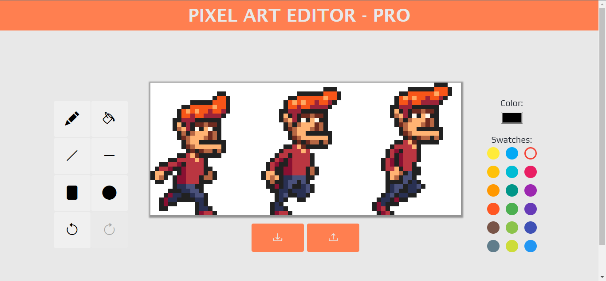

# Pixel-Art-Editor-Pro
>I look at the many colors before me. I look at my blank canvas. Then, I try to apply colors like words that shape poems, like notes that shape music.  
>    -Joan Miro

## Overview
I began learning about computer programming early this year - March/April 2022, so I read ***Eloquent Javascript*** Written by *[Marijn Haverbeke](https://github.com/marijnh)* on advise of a friend and mentor. After completing the book I went on to study on the React framework and Redux Library.

So I decided to recreate the one of my favourite projects from the book Eloquent Javascript with the other new technologies I have learned also enhanced it with a full UI hence **PRO**.

## Original App Interface from Eloquent Javascript

## My App Interface enhanced with Reactjs and Redux

    
    

You can see the hosted app here: [Pixel Art Editor - Pro](http://pelumi-guy.github.io/pixel-art-editor_pro)

You can also check out the book [Eloquent Javascript](https://eloquentjavascript.net/) for yourself.