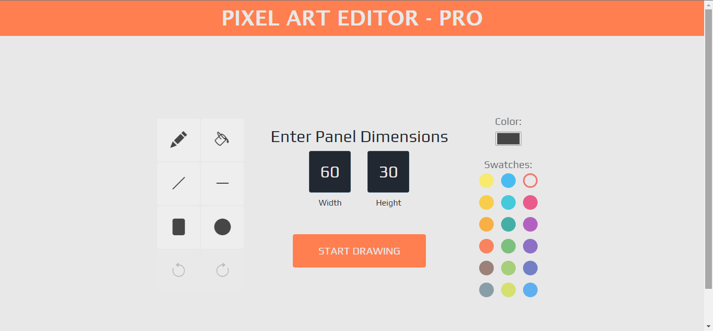

# Pixel-Art-Editor-Pro
>I look at the many colors before me. I look at my blank canvas. Then, I try to apply colors like words that shape poems, like notes that shape music.  
>    -Joan Miro

## Overview

This project involves the development of a user-friendly web application centered around the creation and modification of pixel art. This platform serves as an innovative tool allowing users to generate, edit, and manipulate pixel-based digital art. Not only does it offer a robust editing interface for crafting pixel art from scratch, but it also includes a unique feature enabling users to upload existing images to convert them into pixel art. This functionality allows for versatile creativity and customization, empowering users to transform their photos or images into pixelated renditions. Furthermore, once the pixel art is finalized, the application enables easy downloading of the finished artwork in various file formats, ensuring convenient access and use of the completed pixel art pieces.

I embarked on my programming journey in early 2022, diving into ***Eloquent JavaScript*** by *[Marijn Haverbeke](https://github.com/marijnh)*, recommended by a friend and mentor. Upon completing the book, I delved into studying the React framework and Redux Library.

Motivated by these learnings, I decided to reimagine one of my favorite projects from Eloquent JavaScript, leveraging the new technologies I acquired and enhancing it with a complete user interface, hence the suffix **PRO**.

## Original App Interface from Eloquent Javascript

## My App Interface enhanced with Reactjs and Redux

    
    

You can see the hosted app here: [Pixel Art Editor - Pro](http://pelumi-guy.github.io/pixel-art-editor_pro)

You can also check out the book [Eloquent Javascript](https://eloquentjavascript.net/) for yourself.
